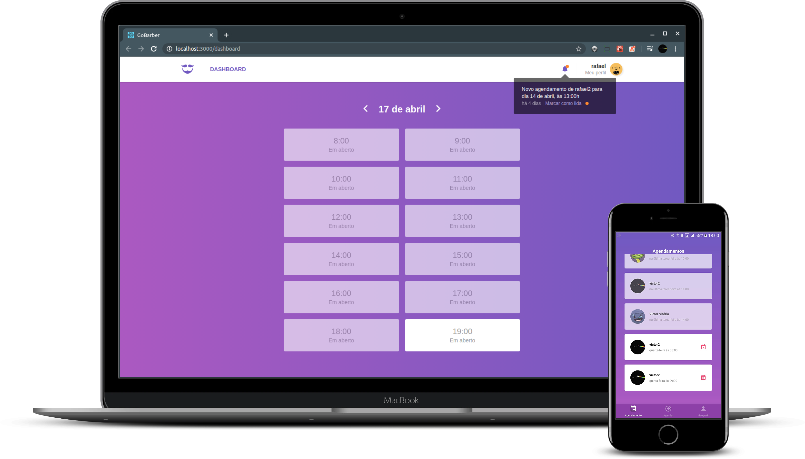

<h1 align="center">
    
</h1>

<blockquote align="center">“Stay hungry, stay foolish - Steve Jobs”</blockquote>

<p align="center">
  <a href="#bulb-about">About</a>&nbsp;&nbsp;&nbsp;|&nbsp;&nbsp;&nbsp;
  <a href="#computer-install">Install</a>&nbsp;&nbsp;&nbsp;|&nbsp;&nbsp;&nbsp;
  <a href="#boom-result">Result</a>&nbsp;&nbsp;&nbsp;|&nbsp;&nbsp;&nbsp;
  <a href="#memo-license">License</a>
</p>

## :bulb: About

<p>In this project, a complete stack was developed, where we used:</p>

- [Node.js](https://nodejs.org/en/)
- [React](https://reactjs.org/)
- [React Native](https://reactnative.dev/)

<p align="justify">
to build the goBarber, application where you manage a barber shop, the backend being responsible for all logistics of the application, frontend for company use, thus managing all appointments and mobile for user, where they can check available hours of your best barber and confirm a haircut.
</p>

## :computer: Install

**Clone**
```
git clone https://github.com/victorvf/goBarber.git
```

**Node.js**

```
- cd backend

- docker-compose build

- docker-compose up
```

**React**

```
- cd frontend

- yarn install

- yarn start
```

**React Native** -> (I developed this application using my own cell phone(ANDROID), then the access settings are with my machine address, we will have to modify them.)

```
- cd mobile

- config/ReactotronConfig.js -> .configure({ host: 'your host' })
- services/api.js -> baseURL: 'http://yourhost:3333',

- yarn install

- yarn android

- yarn start
```

## :boom: Result

<h3 align="center">
    
</h3>

## :memo: License

this project is under the MIT license. See the archive [LICENSE](https://github.com/Rocketseat/bootcamp-gostack-desafio-03/blob/master/LICENSE.md) for more details.
